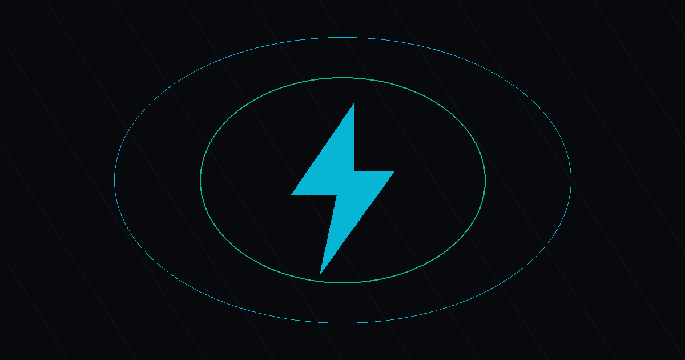

# ⚡ TechPulse: Autonomous Google AMP Web Stories & Tech Portal

> **Next-Generation, Mobile-First Tech Journalism Platform Built with Python & Google AMP Story 1.0, Optimized for Instant Vercel Edge Deployment.**



[](https://amp.dev)
[](https://python.org)
[](https://vercel.com)
[](https://github.com)

---

## 🌟 Key Features

### 1. Futuristic Cyber-Dark Glassmorphic UI
- **Aesthetic**: Deep cyber `#08090d` canvas with frosted glass cards (`rgba(255,255,255,0.04)`), neon cyan (`#06b6d4`) & tech emerald (`#10b981`) glowing accents.
- **Typography**: Google Fonts **Outfit** and **Space Grotesk** paired with JetBrains Mono tags.
- **Visuals**: High-CTR vertical 2:3 posters with dark gradient overlays, live pulse badges, and read-time indicators.
- **Interactive Lightbox Modal**: Native `<dialog>` lightbox featuring smartphone chassis mockup, accessible close button (`✕`), backdrop blur, keyboard controls (`Esc` / `/`), and full **Browser History (`popstate`)** support for device back-button navigation.
- **Instant Search & Filtering**: Client-side instant keyword search and category pills:
  - 🤖 **AI Tools & Hacks**
  - 📱 **Smartphones & Leaks**
  - 🎧 **Gadgets & Audio**
  - 🚀 **Future Tech & Computing**
  - 🎮 **Gaming Gear**

### 2. High-CTR Autonomous Content Engine
- **Multi-Source Ingestion**: Automatically consumes top tech feeds (The Verge, TechCrunch, Android Police, Engadget, Google News Tech) with a rich built-in curated viral fallback dataset.
- **Story Synthesizer**: Powered by **Google Gemini 3.8 Flash** (`google-genai` SDK) with a deterministic NLP rule-engine fallback.
- **5-Slide Story Structure**:
  1. *Slide 1*: High-curiosity Hook & Vibrant Visual Poster.
  2. *Slide 2*: Core breakthrough, hardware reveal, or key problem.
  3. *Slide 3*: Hardware specs, benchmarks, and deep-dive badges.
  4. *Slide 4*: Competitive edge and market impact.
  5. *Slide 5*: `⚡ TechPulse Verdict` with direct source coverage link.

### 3. 100% Google AMP Story 1.0 Compliance
- Built with zero AMP validation errors.
- Verified with official `amphtml-validator`.
- Test suite script (`python validator.py`) guarantees 100% compliance across all generated pages.

### 4. Google AdSense & SEO Architecture
- **4 Mandatory Policy Pages** styled in the site's cyber-dark theme:
  - `/about/` — Tech journalism mission, editorial standards, and transparent AI disclosure.
  - `/privacy/` — Full Google AdSense DART cookies disclosure, GDPR and CCPA rights.
  - `/terms/` — Fair Use (17 U.S.C. § 107) and trademark disclaimers (Apple, Google, Samsung, Qualcomm, Nvidia, etc.).
  - `/contact/` — Editorial desk with official email: **`sumits7196@gmail.com`**.
- **Dynamic Sitemaps**: `sitemap.xml` with Google `<image:image>` tags for every story and page.
- **Robots.txt**: Auto-generated directing search crawlers to `sitemap.xml`.
- **OpenGraph & Schema.org**: Rich `TechArticle` and `WebSite` JSON-LD markup on every page.

---

## 🚀 Quickstart & Local Execution

### 1. Clone & Install Dependencies

```bash
# Clone the repository
git clone <your-repo-url>
cd techPulse

# Install Python requirements
pip install -r requirements.txt
```

### 2. (Optional) Configure Gemini API

Copy or create `.env` in the root directory:

```env
# Optional: If omitted, the engine automatically uses the deterministic fallback rules
GEMINI_API_KEY="your-gemini-api-key-here"

# Customizable Brand Name (e.g. "TechPulse" or "TechByte")
TECHPULSE_NAME="TechPulse"

# Production Domain URL
SITE_URL="https://your-vercel-domain.vercel.app"

# Editorial Email
CONTACT_EMAIL="sumits7196@gmail.com"
```

### 3. Run Pipeline End-to-End

```bash
python fetch_and_generate.py
```

This single command:
1. Fetches feeds & curated stories.
2. Synthesizes 5-slide stories.
3. Generates AMP stories in `dist/stories/<slug>/index.html`.
4. Builds `dist/index.html` and legal pages (`dist/about/`, `dist/privacy/`, `dist/terms/`, `dist/contact/`).
5. Generates `dist/sitemap.xml`, `dist/robots.txt`, and `dist/stories.json`.
6. Copies static CSS, JS, and image assets.
7. Executes the AMP validator test suite.

### 4. Validate AMP Stories Independently

```bash
python validator.py
```

### 5. Preview Locally

```bash
# Preview using any static HTTP server:
python -m http.server 3000 --directory dist
```
Open [http://localhost:3000](http://localhost:3000) in your browser.

---

## 🛠️ Git Initialization & Vercel Deployment

### Step 1: Initialize Git & Commit Files

```bash
git init
git add .
git commit -m "⚡ Initial commit: TechPulse Autonomous AMP Web Stories Portal"
git branch -M main
```

### Step 2: GitHub Repository Linked

The repository is live at:
[https://github.com/ssilu07/techpulse](https://github.com/ssilu07/techpulse)

```bash
git remote add origin https://github.com/ssilu07/techpulse.git
git push -u origin main
```

### Step 3: Link to Vercel

1. Log into [vercel.com](https://vercel.com).
2. Click **"Add New..."** -> **"Project"**.
3. Import your `techPulse` GitHub repository.
4. **Build and Output Settings**:
   - Output Directory: `dist` (pre-configured via `vercel.json`).
5. **Environment Variables**:
   - `GEMINI_API_KEY`: *(Optional)* Your Google Gemini API Key.
   - `TECHPULSE_NAME`: `TechPulse` (or `TechByte`).
   - `SITE_URL`: `https://<your-project>.vercel.app`.
6. Click **Deploy**. Your portal and all AMP stories will be live immediately!

---

## ⏰ Activating the 4-Hour Autopilot Workflow

The included GitHub Actions workflow [`.github/workflows/auto_update.yml`](.github/workflows/auto_update.yml) runs every 4 hours (`0 */4 * * *`):

1. Go to your GitHub repository -> **Settings** -> **Secrets and variables** -> **Actions**.
2. Under **Repository secrets**, add:
   - `GEMINI_API_KEY`: Your Gemini API key (optional; deterministic fallback runs if not provided).
3. Under **Variables**, add:
   - `SITE_URL`: Your live Vercel URL (e.g., `https://techpulse.vercel.app`).
4. Under **Settings** -> **Actions** -> **General** -> **Workflow permissions**:
   - Select **"Read and write permissions"** and check **"Allow GitHub Actions to create and approve pull requests"**.
   - Click **Save**.

### Preventing Vercel Hobby Multi-User Blocking:
The workflow is specifically configured to commit using the repository owner identity (`${{ github.actor }}`):
```yaml
git config --global user.name "${{ github.actor }}"
git config --global user.email "${{ github.actor_id }}+${{ github.actor }}@users.noreply.github.com"
```
Because the committer matches the repository owner, Vercel Hobby accounts will **not** block the deployment with "author not a team member" errors. Every push to `main` instantly triggers a fresh static build on Vercel!

---

## 📁 Project Architecture

```
techPulse/
├── config.py                 # Central configuration (branding, feeds, categories, styling)
├── content_engine.py         # Multi-source RSS feed fetcher & curated viral fallback dataset
├── synthesizer.py           # Gemini 3.8 Flash story synthesizer + deterministic rule engine
├── story_builder.py          # 100% AMP Web Story generator (5 slides, metadata, JSON-LD)
├── portal_builder.py         # Cyberpunk portal homepage generator + 4 legal pages + sitemap
├── validator.py              # AMP HTML validator test suite running npx amphtml-validator
├── fetch_and_generate.py     # Standalone orchestrator pipeline
├── static/
│   ├── css/portal.css        # Futuristic cyber-dark glassmorphic styles
│   ├── js/portal.js          # Search, category pills, lightbox modal with history back
│   └── images/
│       ├── logo.svg          # Cyberpunk brand logo
│       ├── publisher-logo.png# High-res 512x512 AMP publisher icon
│       └── og-banner.png     # 1200x630 OpenGraph social preview banner
├── dist/                     # Generated production static files (ready for Vercel)
│   ├── index.html            # Portal homepage
│   ├── stories/<slug>/       # 100% compliant AMP Web Story files
│   ├── about/                # Mission, editorial standards & AI disclosure
│   ├── privacy/              # Google AdSense DART cookies, GDPR & CCPA
│   ├── terms/                # Fair Use (17 U.S.C. § 107) & trademark disclaimers
│   ├── contact/              # Editorial desk with sumits7196@gmail.com
│   ├── sitemap.xml           # Sitemaps Protocol 0.9 with <image:image>
│   ├── robots.txt            # Crawlers index instruction
│   └── stories.json          # Machine-readable headless story feed
├── .github/workflows/
│   └── auto_update.yml       # 4-hour GitHub Actions cron workflow
├── vercel.json               # Vercel routing, outputDirectory & caching headers
└── requirements.txt          # Python dependencies
```

---

## ⚖️ Compliance & Editorial Notice

- **AMP Validation**: All stories strictly conform to Google AMP Story 1.0 guidelines.
- **Fair Use**: News commentary and reporting complies with 17 U.S.C. § 107.
- **Contact**: Reach the editorial desk at **`sumits7196@gmail.com`**.
